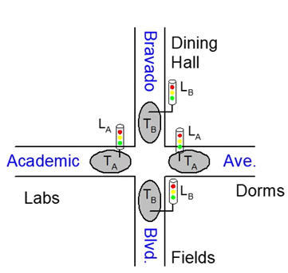
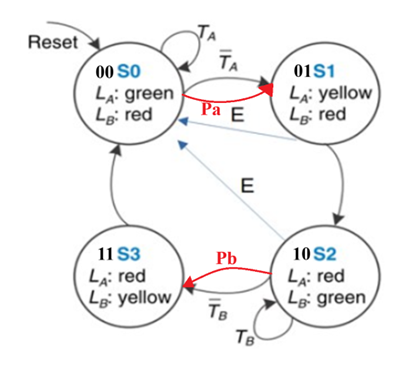
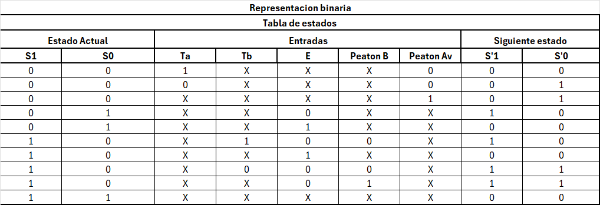
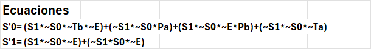
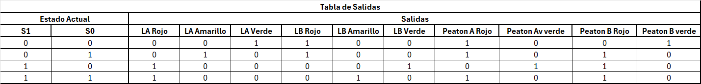
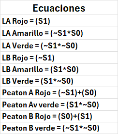

# Segundo Parcial

## Diseño y diagrama de flujo
Para este Segudo parcial se realiza una FSM de un semaforo de dos vias según la siguiente imagen: 
 , 

Donde lo que se pide es que se le agrugue una funcion unica, la cual para esta entrega yo lo que he agregado es tener botones para pasos peatonales, asi como tambien cambiar las salidas de 2 leds por semaforo a tener que cada led represente una sola luz de los semaforos.

La funcion extra cosnta en, un botón para cruce peatonal, el cual consiste en si la calle que se quiere cruzar tiene tránsito y el semáforo está en verde, el peatón puede presionar un botón y el semáforo correspondiente a la calle que se quiere cruzar se pondrá en rojo, y cuando este en rojo la calle se prende una luz peatonal en color verde indicando que el peatón puede cruzar, el diagrama de flujo quedaria como el siguiente: 

Con este diagrama de estados se procede a sacar las tablas de estados, y las ecuaciones resultantes:

, 

, 

>si se desea ver estas tablas, puede descargar el archvio de [Tablas de estados](Documentos/Tablas%20de%20estados.xlsx)
>si es necesario tambien se provee una simulacion en logisim en el archivo [Simulacion](Documentos/Simulacion.circ)

## Código Vivado
>Todos los archivos de Vivado se encuentran en la carpeta [Vivado](Vivado/)
>esta carpeta se puede descargar y ejecutar el archivo de [SegundoParcial.xpr](Vivado/SegundoParcial.xpr) y se tendra
>el proyecto en vivado.

El codigo se divide en 3 modulos, [FSM_Top.sv](Vivado/SegundoParcial.srcs/sources_1/new/FSM_Top.sv) , [My_clk.sv](Vivado/SegundoParcial.srcs/sources_1/new/My_clk.sv), [FSM_Semaforo](Vivado/SegundoParcial.srcs/sources_1/new/FSM_Semaforo.sv)

### FSM_Top:
En este mandamos a llamar las funciones de clck_psc y FSM_Semaforo como instancias. En este también tenemos declaradas las entradas y salidas, tenemos los switches del 0 al 5 como entradas y los leds del 0 al 10 como salidas. 

### My_CLK:
En este programa lo que hacemos es aprovechar el pulso de el reloj de 100Mhz que tenemos en la basys 3 para crear un programa que haga gastar recursos lo que hace que se cree un delay.

### FSM_Semaforo:
n este se describe el funcionamiento de la maquina de estados finitos, donde se representan todas las entradas y cada una de las salidas de los semáforos, también podemos ver las etapas de la maquina de estados como el next state logic, state register y el output logic.

## Resutados

