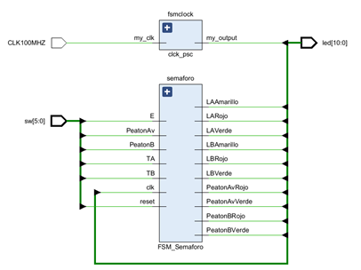
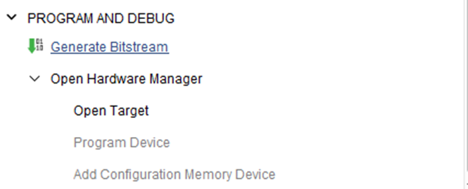

# Segundo Parcial

## Diseño y diagrama de flujo
Para este Segudo parcial se realiza una FSM de un semaforo de dos vias según la siguiente imagen: 
  

Donde lo que se pide es que se le agrugue una funcion unica, la cual para esta entrega yo lo que he agregado es tener botones para pasos peatonales, asi como tambien cambiar las salidas de 2 leds por semaforo a tener que cada led represente una sola luz de los semaforos.

La funcion extra cosnta en, un botón para cruce peatonal, el cual consiste en si la calle que se quiere cruzar tiene tránsito y el semáforo está en verde, el peatón puede presionar un botón y el semáforo correspondiente a la calle que se quiere cruzar se pondrá en rojo, y cuando este en rojo la calle se prende una luz peatonal en color verde indicando que el peatón puede cruzar, el diagrama de flujo quedaria como el siguiente: 

Con este diagrama de estados se procede a sacar las tablas de estados, y las ecuaciones resultantes:

 

>si se desea ver estas tablas, puede descargar el archvio de [Tablas de estados](Documentos/Tablas%20de%20estados.xlsx)
>si es necesario tambien se provee una simulacion en logisim en el archivo [Simulacion](Documentos/Simulacion.circ)

## Código Vivado
>Todos los archivos de Vivado se encuentran en la carpeta [Vivado](Vivado/)
>esta carpeta se puede descargar y ejecutar el archivo de [SegundoParcial.xpr](Vivado/SegundoParcial.xpr) y se tendra
>el proyecto en vivado.

El codigo se divide en 3 modulos, [FSM_Top.sv](Vivado/SegundoParcial.srcs/sources_1/new/FSM_Top.sv) , [My_clk.sv](Vivado/SegundoParcial.srcs/sources_1/new/My_clk.sv), [FSM_Semaforo](Vivado/SegundoParcial.srcs/sources_1/new/FSM_Semaforo.sv)

### FSM_Top:
En este mandamos a llamar las funciones de clck_psc y FSM_Semaforo como instancias. En este también tenemos declaradas las entradas y salidas, tenemos los switches del 0 al 5 como entradas y los leds del 0 al 10 como salidas. 

### My_CLK:
En este programa lo que hacemos es aprovechar el pulso de el reloj de 100Mhz que tenemos en la basys 3 para crear un programa que haga gastar recursos lo que hace que se cree un delay.

### FSM_Semaforo:
n este se describe el funcionamiento de la maquina de estados finitos, donde se representan todas las entradas y cada una de las salidas de los semáforos, también podemos ver las etapas de la maquina de estados como el next state logic, state register y el output logic.

## Pasos develpment Flow
>Si se desea ver esta parte en formato de PDF puede encontrarlo en la carpeta Documentos como: [Pasos Development Flow](Documentos/Pasos%20Development%20Flow.pdf)

### 1 RTL Analisis

En esta etapa se verifica la sintaxis del código, código en el cual describimos el sistema utilizando HDL, se verifica también los constraints y que todo cumpla correctamente, también se hace un esquemático de el sistema descrito en código. 
Por ejemplo, en esta ocasión ya que se crean dos módulos, en el esquemático podemos ver los módulos representados como bloques. 

Al seleccionar cada módulo podemos ver la circuitería interna:

### 2 Simulación
En esta parte se verifica el desempeño del código, si las funcionalidades y especificaciones satisfacen con las especificaciones del sistema, esta disponible en el pre y post de varias etapas.

Por ejemplo, podemos ir forzando constantes y corriendo la simulación para ver que es lo que sucede en las salidas, en este forzamos los switches y corremos la simulación nos proporciona las salidas exactas para el estado S0, y del lado derecho podemos ver los cambios de los estados conforme al tiempo. 

Aquí tenemos una segunda simulación donde ponemos 1 en el Switch 2 lo que proporciona un cambio en las salidas, y podemos verlo del lado derecho.

### 3 Synthesis 
Al realizar la synthesis podemos ver si nuestro dispositivo es capaz de poder realizar la función de nuestro código, con los componentes que este posee. A continuación, podemos ver la basys3, y las partes resaltadas son los componentes que se utilizaran para correr este código.

Si hacemos zoom a estos componentes marcados podemos ver conectividad y de que se trata.
   

También lo que podemos observar es el esquemático con los componentes que se usaran de nuestra placa basys3, podemos ver que LUTs se vana utilizar y que otros componentes son los que se usaran para realizar los semáforos.

### 4 Implementación
En este apartado ya podemos ver las partes que se van a utilizar para la implementación, así como las conexiones que se realizan, por ejemplo, podemos ver que se genera una imagen como en synthesis pero ahora con ciertas slice resaltadas.

Si vamos haciendo zoom por partes podemos ver las slice que están seleccionadas

Si nos acercamos aún más podemos ver los componentes de los slice que se están utilizando

Por último, podemos seleccionar los componentes y ver sus conexiones.

### 5 Program and Debug

Por último, en este apartado lo que hacemos es generar un bitstream que configura las celdas lógicas y los switches programables, genera acorde al netlist final, luego de generarlo y conectar la basys3 podemos cargar y descargar hacia el FPGA utilizando diversos métodos.

## Discusión y análisis de resultados
El examen ha cumplido de manera satisfactoria con su propósito al permitir que el alumno demuestren competencia en el diseño e implementación de máquinas de estados finitos. Esta evaluación ha brindado a el estudiante la oportunidad de aplicar los conceptos aprendidos en clase para desarrollar una máquina de estados finitos funcional, así como para implementarla utilizando Verilog y la placa Basys3. Esta implementación práctica en hardware proporciona una validación tangible de los conocimientos adquiridos, permitiendo a el alumno observar directamente el comportamiento de la máquina de estados finitos en un entorno físico. En resumen, el examen ha sido efectivo en su enfoque pedagógico al fomentar la comprensión y aplicación de conceptos clave relacionados con las máquinas de estados finitos.

# Video de Youtube 
En el siguiente link se puede encontrar el video de youtube del parcial 2.

## [Segundo Parcial](https://youtu.be/xyOTxmyEeUI)